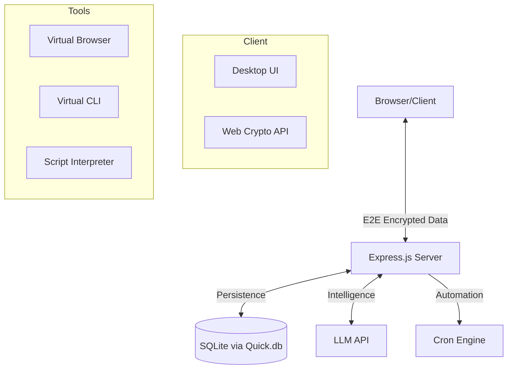

# AgenTick OS ⚡

**AgenTick** is an agentic, web-based operating-system-like frontend for AI. It provides a premium desktop experience with a virtual encrypted filesystem, virtual browser, scheduled automation, and a custom "vibe-coded" script engine.

## 🌟 Key Features

- **🛡️ End-to-End Encryption**: Virtual files and notes are encrypted client-side using AES-256-GCM. The server never sees your plaintext data.
- **🤖 Agentic AI Pipeline**: A sophisticated tool-calling loop that allows the AI to perform complex, multi-step tasks across the OS.
- **📜 Script Editor (Vibe-coded Tools)**: Create your own custom tools using natural language instructions. The AI discovers and executes them dynamically.
- **🌐 Virtual Browser**: A sandboxed browsing environment with server-side proxying and LLM-powered navigation.
- **⏰ Heartbeat Scheduler**: Create automation jobs in plain English (e.g., "Check the news every morning at 8am") that run even when you're offline.
- **📁 Encrypted Virtual FS**: A full unix-like virtual filesystem accessible via the File Manager or a virtual CLI tool.
- **✨ Premium UI**: Modern glassmorphic design, draggable/resizable windows, taskbar, start menu, and customizable themes.

## 🛠️ Tech Stack

- **Backend**: Node.js, Express.js
- **Database**: `quick.db` (9.1.7) + `better-sqlite3` (12.6.2)
- **Frontend**: Vanilla HTML5, CSS3 (Glassmorphism), JavaScript (ES Modules)
- **Security**: Web Crypto API (E2E), Bcrypt (Auth), Helmet, Rate Limiting
- **AI Integration**: OpenAI-compatible API interface

## 🚀 Getting Started

### Prerequisites

- [Node.js](https://nodejs.org/) (v18 or later recommended)
- An OpenAI-compatible LLM endpoint (e.g., Ollama, LocalAI, or OpenAI itself)

### Installation

1. **Clone the repository**:

   ```bash
   git clone <your-repo-url>
   cd AgenTick
   ```

2. **Install dependencies**:

   ```bash
   npm install
   ```

3. **Configure environment**:
   Create a `.env` file in the root directory (see `.env.example`):

   ```env
   PORT=3001
   SESSION_SECRET=your-random-secret
   LLM_ENDPOINT=http://localhost:11434/v1/chat/completions
   LLM_MODEL=llama3
   ```

4. **Start the server**:

   ```bash
   npm start
   ```

5. **Open in browser**:
   Navigate to `http://localhost:3001`

## 📖 Usage

1. **Register**: Create an account. Your password is used to derive your encryption key.
2. **AI Terminal**: Talk to the agent to perform tasks, browse the web, or manage files.
3. **File Manager**: Double-click to open, right-click to delete. Everything here is E2E encrypted.
4. **Script Editor**: Add a new tool, describe its logic in plain English, and the AI will "learn" to use it.
5. **Scheduler**: Ask the AI to set up recurring tasks based on your custom tools or core capabilities.

## 🏗️ Architecture



## 📜 License

MIT License. See [LICENSE](LICENSE) for details.
